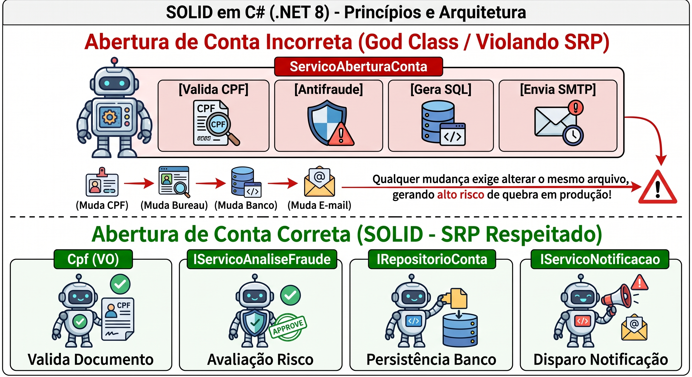
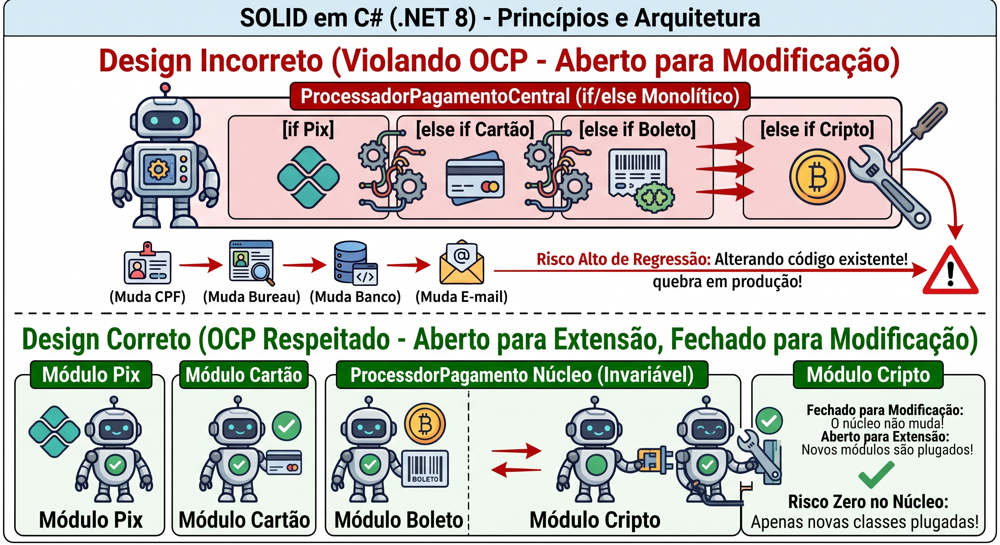
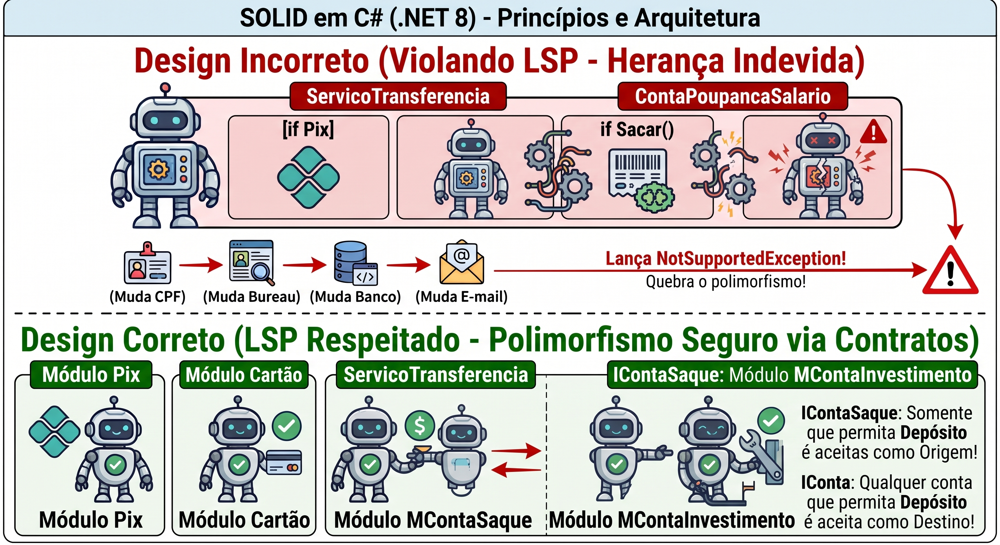
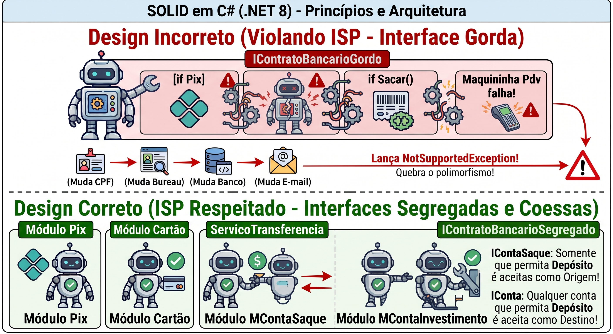
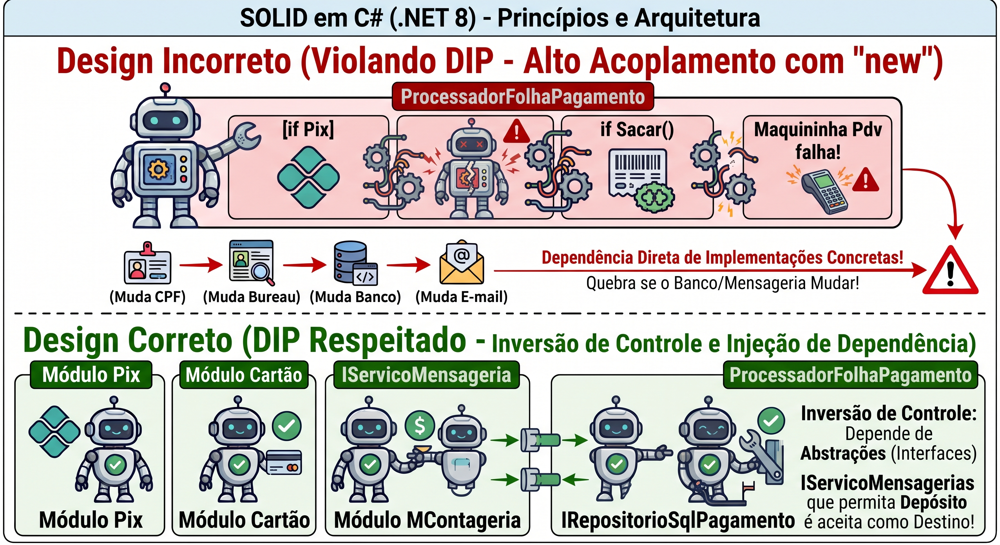

# Princípios SOLID em C# (.NET 8)

Repositório prático para estudo, consulta e demonstração técnica dos princípios **SOLID**, contrastando implementações com alto acoplamento (anti-padrões) contra soluções desacopladas, coesas e preparadas para testes de unidade.

---

## 1. S - Princípio da Responsabilidade Única (Single Responsibility Principle - SRP)

> **Definição:** *Uma classe ou módulo deve ter um, e apenas um, motivo para mudar.*

### 🤖 Ilustração Visual do Conceito

---

## 2. O - Princípio Aberto/Fechado (Open/Closed Principle - OCP)

> **Definição:** *Entidades de software (classes, módulos, funções) devem estar abertas para extensão, mas fechadas para modificação.*

### 🤖 Ilustração Visual do Conceito

### 📊 Comparativo Técnico

| Aspecto | Modo Incorreto (`Ocp.Incorreto`) | Modo Correto (`Ocp.Correto`) |
| :--- | :--- | :--- |
| **Extensibilidade** | Baixa. Adicionar um novo meio de pagamento exige alterar a classe central com novos `if/else`. | Alta. Para suportar um novo meio, cria-se apenas uma nova classe que implementa `IEstrategiaPagamento`. |
| **Risco de Regressão** | Alto. Alterar código existente pode introduzir bugs em meios de pagamento que já estavam estáveis em produção. | Zero no núcleo. O processador existente nunca é modificado; apenas novas classes são injetadas. |
| **Padrão Aplicado** | Código procedural acoplado. | **Strategy Pattern** combinado com injeção de dependência e polimorfismo. |

---

## 3. L - Princípio da Substituição de Liskov (Liskov Substitution Principle - LSP)

> **Definição:** *Objetos de uma superclasse devem poder ser substituídos por objetos de suas subclasses sem quebrar o comportamento e a integridade do sistema.*

### 🤖 Ilustração Visual do Conceito

### 📊 Comparativo Técnico

| Aspecto | Modo Incorreto (`Lsp.Incorreto`) | Modo Correto (`Lsp.Correto`) |
| :--- | :--- | :--- |
| **Herança** | `ContaPoupancaSalario` herda `ContaBancaria`, mas lança `NotSupportedException` ao tentar sacar. | Hierarquia segregada: contas que sacam implementam `IContaSaque`; contas de aporte implementam `IConta`. |
| **Segurança Polimórfica** | Baixa. Métodos genéricos que recebem `ContaBancaria` quebram aleatoriamente dependendo da subclasse instanciada. | Alta. O compilador garante que apenas contas com capacidade real de saque possam ser passadas como origem de transferência. |
| **Princípio Relacionado** | Violação de herança gera código frágil e obriga o uso de `if (conta is ContaPoupancaSalario)` (quebrando também o OCP). | Segregação de interfaces e composição evitam herança cega. |

---

## 4. I - Princípio da Segregação de Interfaces (Interface Segregation Principle - ISP)

> **Definição:** *Clientes não devem ser forçados a depender de interfaces ou métodos que não utilizam.*

### 🤖 Ilustração Visual do Conceito

### 📊 Comparativo Técnico

| Aspecto | Modo Incorreto (`Isp.Incorreto`) | Modo Correto (`Isp.Correto`) |
| :--- | :--- | :--- |
| **Granularidade da Interface** | Interface "monolítica/gorda" (`IContratoBancarioGordo`) que mistura operações díspares. | Múltiplas interfaces granulares (`ITransacionavel`, `IAutenticavelBiometria`, `IEmissorComprovante`, `IFinanciavel`). |
| **Integridade de Código** | Classes simples lançam `NotImplementedException` para métodos que não têm capacidade de executar. | Classes implementam apenas os contratos estritamente suportados por seu domínio e hardware. |
| **Acoplamento** | Alto. Alterar a assinatura de um método na interface monolítica quebra classes não relacionadas no sistema. | Mínimo. Mudanças em `IFinanciavel` afetam apenas os fluxos de crédito, sem impactar o PDV de pagamentos. |

---

## 5. D - Princípio da Inversão de Dependência (Dependency Inversion Principle - DIP)

> **Definição:** *Módulos de alto nível não devem depender de módulos de baixo nível. Ambos devem depender de abstrações. Abstrações não devem depender de detalhes; detalhes devem depender de abstrações.*

### 🤖 Ilustração Visual do Conceito

### 📊 Comparativo Técnico

| Aspecto | Modo Incorreto (`Dip.Incorreto`) | Modo Correto (`Dip.Correto`) |
| :--- | :--- | :--- |
| **Direção do Acoplamento** | Alto nível amarrado a ferramentas concretas (`new RepositorioSqlServer()`, `new ServicoSmtp()`). | Alto nível orquestra contratos (`IRepositorioPagamento`, `IServicoMensageria`). |
| **Testabilidade** | Impossível realizar testes de unidade sem banco SQL ou SMTP ativo. | Testabilidade isolada via Mocks (`Moq`, `NSubstitute`). |
| **Substituição de Infraestrutura** | Trocar SQL Server por Oracle ou RabbitMQ por AWS SQS exige editar o domínio de negócio. | O domínio permanece intacto; altera-se apenas a classe de infraestrutura registrada no container de DI. |